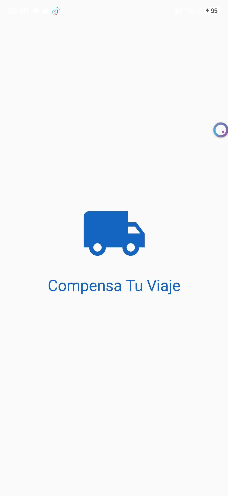
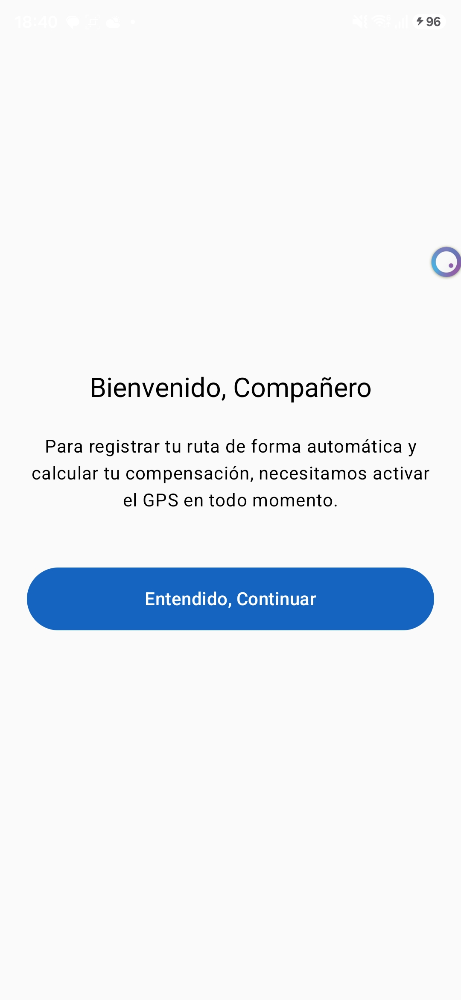
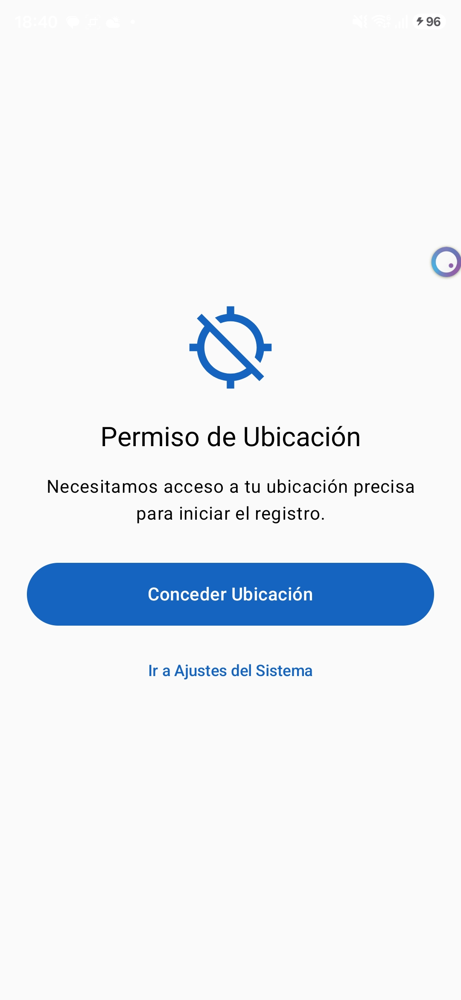
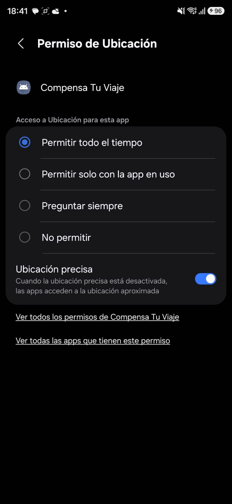
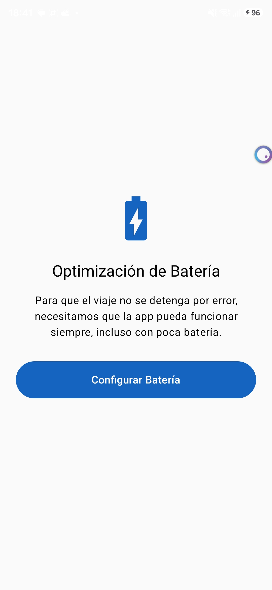

# Módulo 08: Onboarding de Telemetría
**Equipo:** mova  
**Proyecto:** Compensa Tu Viaje — Registro de Flota B2B

## 🚛 Sobre este módulo
Este es el punto de entrada para el chofer. Su objetivo es asegurar que el dispositivo esté correctamente configurado antes de iniciar cualquier ruta. Como la app es una herramienta de trabajo crítica, este módulo garantiza que el GPS y la gestión de batería no interrumpan el rastreo en segundo plano.

## 👥 Equipo mova
*   **Apaza Quispe Ivan** — *Desarrollo de Arquitectura y Lógica de Permisos*
*   *(Espacio para más integrantes...)*

## 🛠️ ¿Qué implementamos?
Diseñamos un flujo de 5 pantallas pensando en el **chofer de camión** (botones grandes, mensajes claros y cero distracciones técnicas):

1.  **Splash Screen Inteligente:** Muestra la marca y decide si el chofer debe configurar permisos o si puede saltar directamente al trabajo.
2.  **Pantalla de Bienvenida:** Explica de forma sencilla por qué necesitamos el GPS (sin usar palabras técnicas aburridas).
3.  **Gestión de GPS (Android 11+):** Manejamos el permiso de ubicación en dos pasos. Primero el básico y luego el de "Permitir todo el tiempo", que es el que nos permite rastrear con la pantalla apagada.
4.  **Optimización de Batería:** Configuramos el sistema para que no "mate" la app cuando el celular entra en ahorro de energía.
5.  **Confirmación Final:** Un check de éxito para que el chofer sepa que todo está bien y ya puede empezar.

## 💡 Decisiones de Ingeniería (Bonus)
Para asegurar que la app sea robusta, añadimos tres funciones avanzadas:

*   **Salto Automático (Auto-Skip):** Si el chofer ya configuró los permisos antes, el Splash lo detecta y lo manda directo al final en 1.5 segundos. Menos clics para el usuario.
*   **Detección en Caliente (Hot Reload de Permisos):** Si el chofer sale a los "Ajustes del Sistema" para dar un permiso y vuelve a la app, el módulo detecta el cambio al instante sin necesidad de reiniciar la pantalla.
*   **Aislamiento Total:** El módulo funciona por sí solo. Usamos "Fakes" para simular la sesión y el almacenamiento, así que se puede probar incluso si el resto de la app no está terminada.

## 🧪 Pruebas y Calidad
Para verificar que la lógica no falle en ruta, implementamos tests unitarios que cubren todo el flujo. Puedes correrlos con este comando:
```bash
./gradlew :feature:onboarding:test
```

## 📸 Guía Visual (Screenshots)
Aquí puedes ver cómo quedó la interfaz para el operario:

1. **Splash:** 
2. **Bienvenida:** 
3. **GPS:** 
4. **Batería:** 
5. **Éxito:** 

---
*Este módulo se construyó bajo el estándar "Offline-first": la app captura y guarda los permisos localmente para que el trabajo nunca se detenga.*
